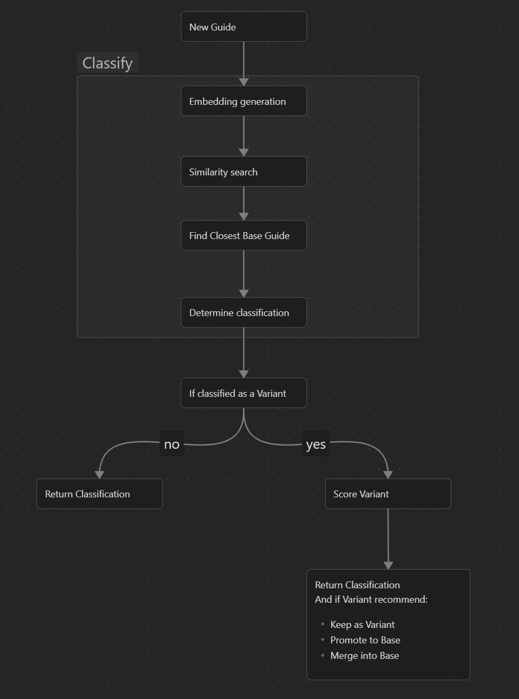

# Guide Classifier

> A Python tool that classifies markdown guides using sentence embeddings to detect duplicates, variants, amendments, and new content, exporting structured results for analysis.

This repo is to test the classification process. It is not part of The B.L.U.E. System but instead a **prototype proposal** for implementating a classification system.

1. Create and activate environment
```bash
python3 -m venv env
source env/bin/activate
```

2. Install dependencies
```bash
pip install -r requirements.txt
```

3. Add guides locally to test
    - create `test_data` directory in repo root directory
    - create `existing` and `new` directories in `test_data` directory
    - add markdown files with content to both `existing` and `new` directories

4. Run script
```bash
python3 src/app.py
```

5. Results in `output/classification_results.json`

## Classifier Process
Currently only classifying based on embeddings is complete.


